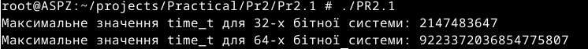
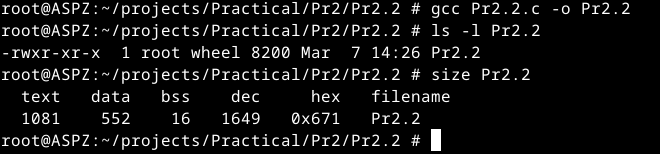
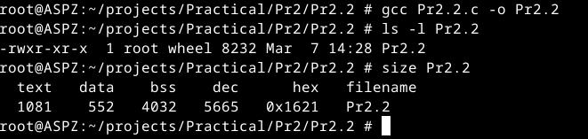
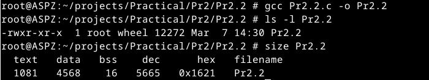
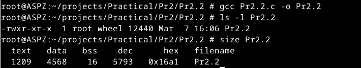
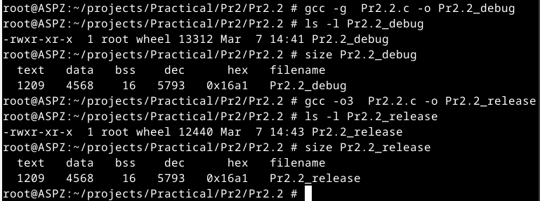

# Практична робота №1
Цей репозиторій cтворений для перегляду виконання практичної роботи №2 з дисципліни "Архітектура системного програмного забезпечення", виконане студентом Щур Р.І., групи ТВ-32.

## Завдання №1
Напишіть програму для визначення моменту, коли time_t
закінчиться.Дослідіть, які зміни відбуваються в залежності від 32- та
64-бітної архітектури. Дослідіть сегменти виконуваного файлу.
## Виконання

Для вирішення задачі було використано бібліотеку stdint.h для отримання цілочисельних типів даних з точно визначеним розміром. Це зроблено тому, що time_t представляє час у вигляді кількості секунд, а кількість секунд зберігається як ціле число. Тому було оголошено дві змінні типу time_t, яким присвоюється максимальне значення 64 та 32-бітного цілого числа.Аналізуючи результат,видно, що розмір time_t на 64-бітній архітектурі значно більший за time_t на 32-бітній архітектурі.

## Завдання №2
Розгляньте сегменти у виконуваному файлі.
1. Скомпілюйте програму &quot;hello world&quot;, запустіть ls -l для
виконуваного файлу, щоб отримати його загальний розмір, і
запустіть size, щоб отримати розміри сегментів всередині нього.
2. Додайте оголошення глобального масиву із 1000 int,
перекомпілюйте й повторіть вимірювання. Зверніть увагу на
відмінності.
3. Тепер додайте початкове значення в оголошення масиву
(пам’ятайте, що C не змушує вас вказувати значення для кожного
елемента масиву в ініціалізаторі). Це перемістить масив із сегмента
BSS у сегмент даних. Повторіть вимірювання. Зверніть увагу на
різницю.
4. Тепер додайте оголошення великого масиву в локальну функцію.
Оголосіть другий великий локальний масив з ініціалізатором.
Повторіть вимірювання. Дані розташовуються всередині функцій,
залишаючись у виконуваному файлі? Яка різниця, якщо масив
ініціалізований чи ні?
5. Які зміни відбуваються з розмірами файлів і сегментів, якщо ви
компілюєте для налагодження? Для максимальної оптимізації?
Проаналізуйте результати, щоб переконатися, що:
## Виконання

Розміри сегментів програми,яка виводить повідомлення "Hello World!!!!"

Після додавання до програми глобального масиву із 1000 int,розмір сегменту неініціалізованих даних (bss) значно збільшився.

Після ініціалізації глобального масиву,сегмент даних збільшився,а значення розміру сегменту неініціалізованих даних (bss) повернулося до початкового.

Після оголошення неініціалізованого великого масиву в локальну функцію та ініціалізованого масиву помітна зміна розміру секції text

Використовуючи команди налагодження і максимальної оптимізації,зміни розмірів сегментів відсутні.

